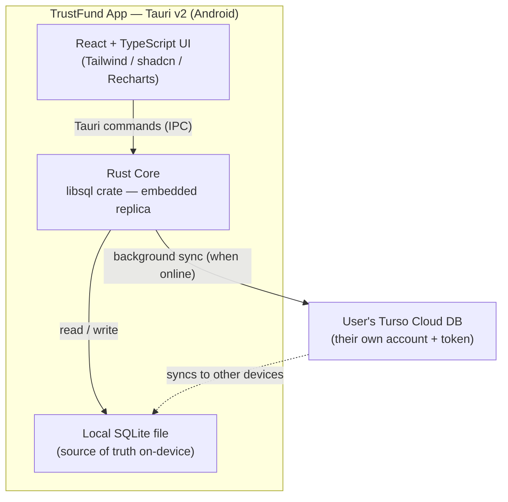
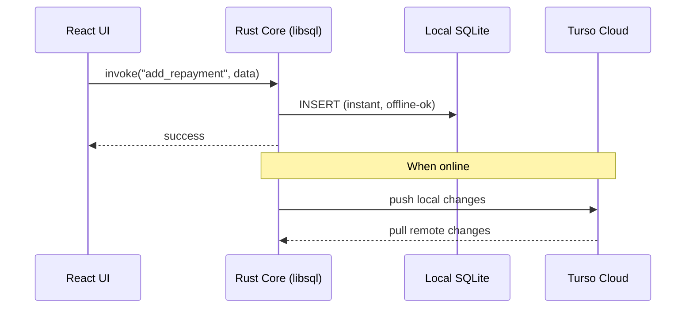
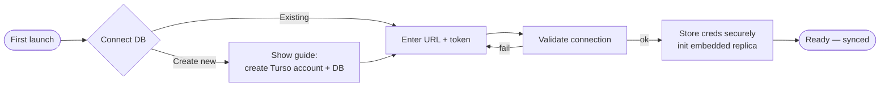
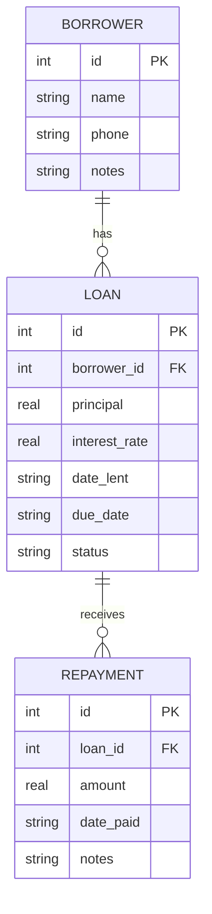

# TrustFund — Architecture

## Overview

TrustFund is a backend-less, offline-first Android app. The UI (React) runs in the Tauri webview; all database work runs on the Tauri **Rust core** using the libSQL embedded replica, which keeps a local SQLite file synced to the user's own Turso cloud database.

## Component diagram

## Data flow (read/write)

## Onboarding flow

## Key technical details

- **DB layer location**: the `libsql` Rust crate runs on Tauri's native core. The React webview never touches libSQL directly — it calls Tauri commands. This is required because embedded replica needs native SQLite bindings + filesystem access (unavailable in the webview/browser).
- **Embedded replica**: local SQLite file is the primary read/write target → instant, offline-tolerant. libSQL handles background sync (push local, pull remote) with the user's Turso cloud DB.
- **Credentials**: user's Turso **DB URL + auth token** are stored on-device via Tauri Store / OS keystore. The token scopes only to that user's own DB, so on-device storage is acceptable (blast radius = their own data).
- **Multi-device sync**: the Turso cloud DB is the sync point; the same URL + token on another device replicates the same data.
- **Conflict handling**: relies on libSQL/Turso replication semantics; single-user editing on one device at a time is the common case (low conflict risk).

## Data model (initial)

## Dashboard queries (examples)

- **Total outstanding** = sum(principal) − sum(repayments) across active loans.
- **Total recovered** = sum(repayments).
- **Overdue** = loans where `due_date < today` and outstanding > 0.
- **Monthly recovery** = repayments grouped by month.

All computable with SQL aggregations against the local SQLite replica.

## Technical risk to validate first

**Spike:** prove the `libsql` Rust crate embedded replica + sync works when driven from a Tauri command on an Android build.

- **If it works** → full offline/sync design proceeds as above.
- **Fallback** → use the libSQL **remote** client (still direct, no backend) with a manual local cache; loses seamless embedded-replica offline model.
