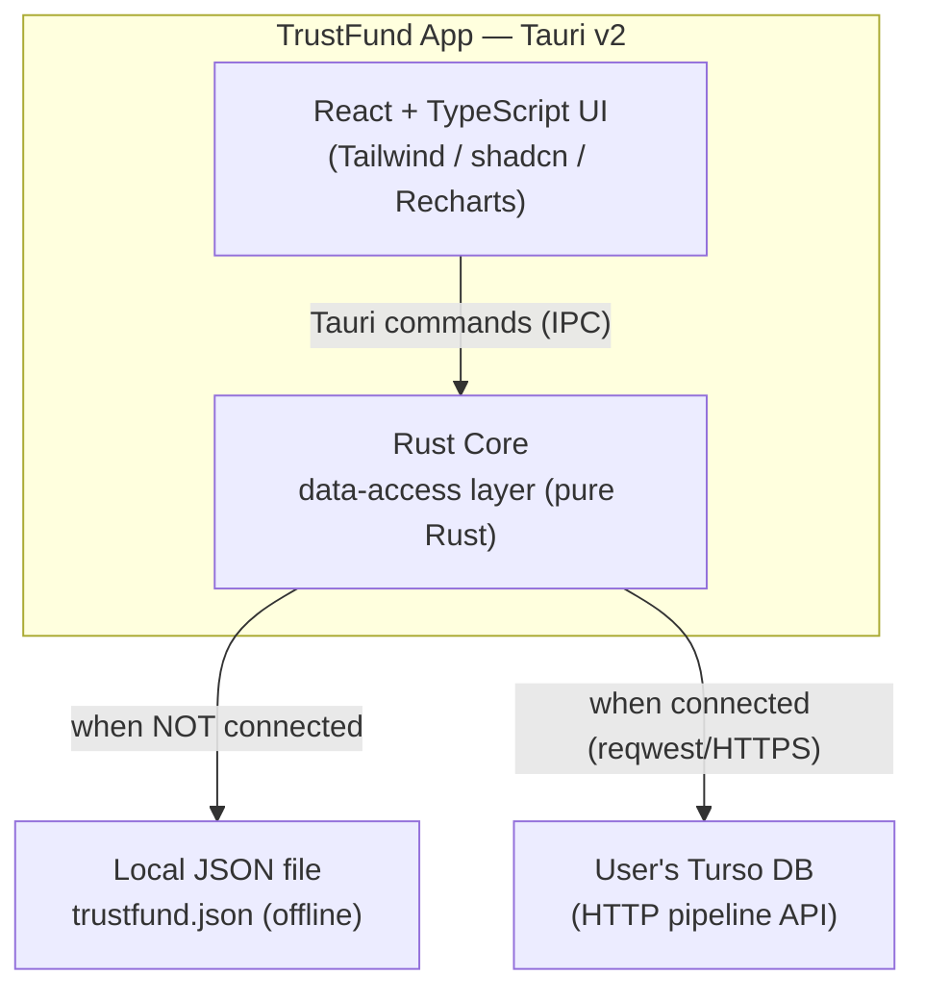
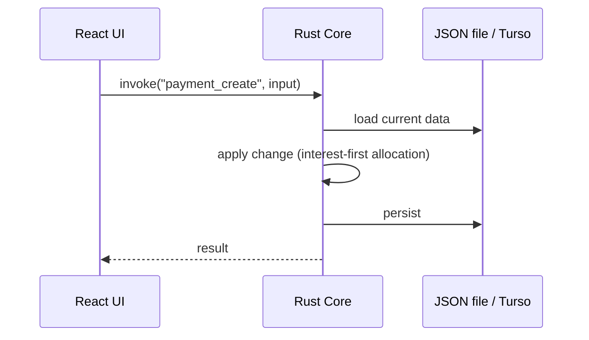
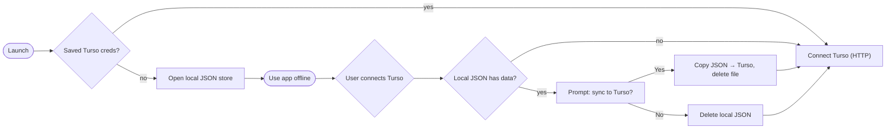
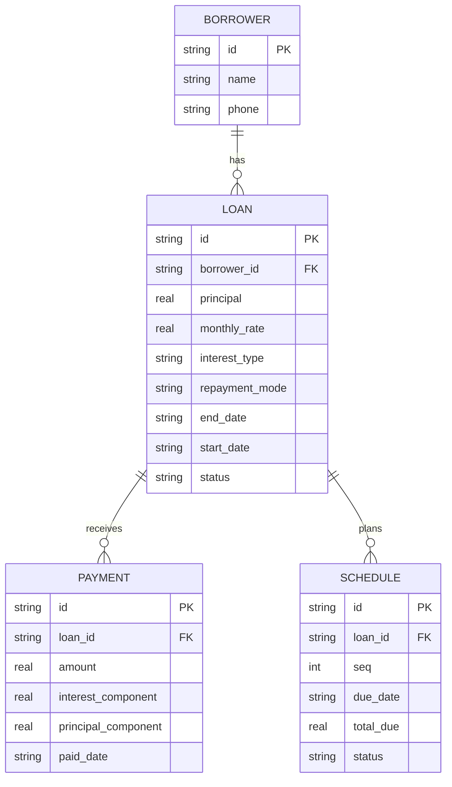

# TrustFund — Architecture

## Overview

TrustFund is a backend-less personal lend & recover tracker. The UI (React)
runs in the Tauri webview; all data work runs on the Tauri **Rust core** and is
**pure Rust** — no native SQLite, so the app builds and runs identically on
every OS (no MSVC / NDK toolchain needed for the data layer).

Two interchangeable storage backends sit behind one data-access layer:

- **JSON file (offline, default)** — when not connected to Turso, data lives in
  a local `trustfund.json` in the app data dir. Works with no account, offline.
- **Turso (remote)** — when the user connects their own Turso database, the app
  reads/writes it directly over Turso's **HTTP pipeline API** (via `reqwest`).
  Same credentials on another device → same data.

> **Why this design?** It removes the native SQLite/libSQL dependency (which
> required a C compiler and failed to build cleanly across OSes), gives a
> no-account offline mode (JSON), and still offers multi-device sync (Turso).

## Component diagram

## Data flow (read/write)

Nothing is cached in memory between operations. Each command loads only what it
needs, operates, and writes back — so memory stays bounded.

## Connection & migration flow

## Key technical details

- **Pure Rust data layer** (`src-tauri/src/`):
  - `store.rs` — `StoreState`: holds only the active backend handle (JSON path
    or Turso client), **no cached dataset**.
  - `data.rs` — transient `Dataset` + load/save runners; row mapping for Turso.
  - `turso.rs` — `reqwest` client for Turso's `/v2/pipeline` HTTP API (real
    per-row tables: borrowers, loans, payments, schedule).
  - `repo_*.rs` — operations over an in-memory `Dataset` (shared by both
    backends); `interest.rs` — the financial rules.
- **No native dependencies**: `reqwest` with `rustls-tls` (pure Rust). No libSQL,
  no bundled SQLite, no C compiler, no MSVC/NDK for the data layer.
- **Credentials**: user's Turso **DB URL + auth token** stored on-device via the
  Tauri Store plugin. The token scopes only to the user's own DB (blast radius =
  their own data).
- **Multi-device**: the Turso DB is the shared source of truth; same URL + token
  on another device = same data. (Remote reads are live, so no stale cache.)
- **Offline**: handled by the JSON backend. When connected to Turso the app is
  online for reads/writes (remote-only); a local cache for connected-mode offline
  is a possible future enhancement.
- **Sharing a connection**: the DB URL + token can be shown as a **QR code** and
  scanned on another device (camera), with manual entry as a fallback.

## Data model

Logical entities (see `data-model.md` for fields). In the JSON backend these are
arrays in one document; in Turso they are per-row tables.

## Computations

Balances, interest-to-date, dashboard summaries, and reports are **computed in
Rust** from the loaded dataset (not stored), using the rules in
`interest-logic.md`. v1 is **simple interest only** (compound deferred to v2).

## Platform / build notes

- **Desktop (Windows/Linux/macOS)** and **Android/iOS** share the same Rust +
  React code. With the native SQLite removed, the data layer needs no per-OS
  toolchain.
- **Android** builds still require the general Tauri Android toolchain (rustup +
  Android targets, JDK, Android SDK/NDK) — these are Tauri requirements, not the
  data layer's.

## Known environment constraint (JFrog mirror)

`tauri build` enforces that the Rust `tauri` crate and the npm `@tauri-apps/*`
packages share the same major.minor. In the current environment the JFrog npm
mirror caps `@tauri-apps/api` at **2.11.1**, while the Rust crates resolve to
**2.12** (the mirrored Rust `tauri` 2.11.x is a broken publish and won't
compile). Until the mirror carries the 2.12 npm packages (or a working 2.11 Rust
crate), `tauri build`'s installer bundling is blocked. Workaround: build the app
binary directly with `pnpm run build:binary` (frontend + `cargo build --release`),
which bypasses the CLI's version-check. Dev (`tauri dev`) only warns.
